As a running example, we take the classical light bulb.
- We start with one that can only turn on and off — a toggle.
- We then add intensity — replacing the toggle mechanism by a clicker that moves "linearly" over the intensity levels.
- Then we add the ability to go back in intensity levels — we start having "arrows" for buttons.

We start with a classic light bulb state machine. The bulb can be either `Off` or `On`.
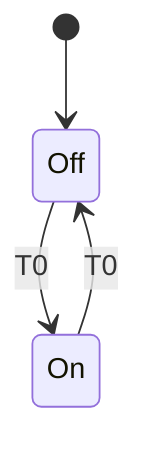

Considering that we're going to add different light intensities, let's change `Off` and `On` to `0` and `1`.

Conceptually, nothing changed. Sure, we have a different name for the state, but that's it.
We can address this change using Cambria (we can also not change anything, depending on the implementation).

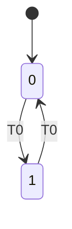

To add an intermediate setting one might be tempted to write the following state machine:

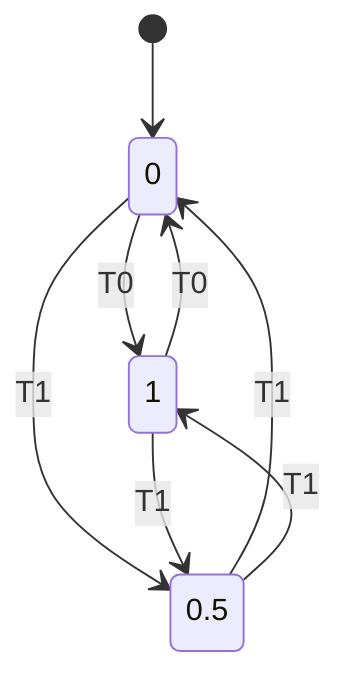

However, this implementation is not a DFA as there are two outgoing `T1` edges from `0,5`.

Hence, we need to convert it into a DFA:

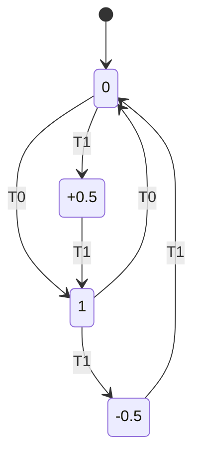

We now have a proper DFA that cycles over the available intensities.

On to extend the DFA with the ability to go back in intensity:
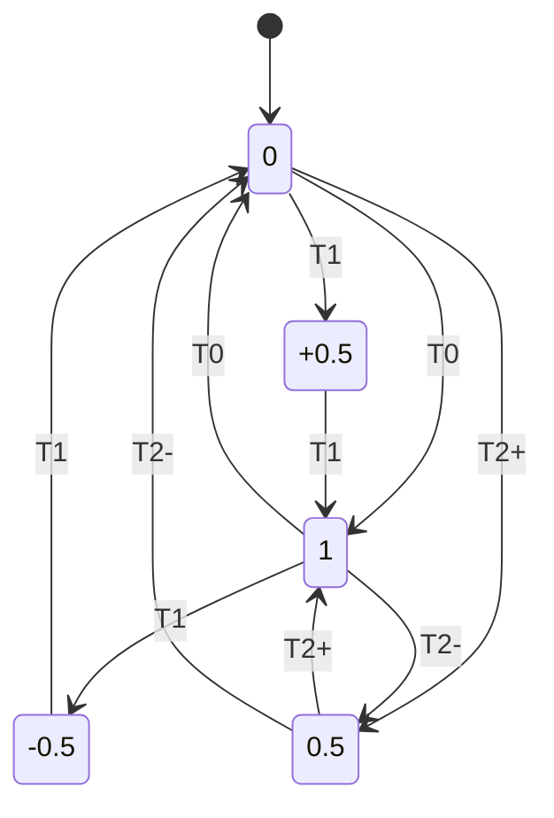

If you squint, this state machine looks like the NFA one, but now there isn't any duplicate outgoing edges and hence, it's still a valid DFA.

Let's start sketching the transitions, consider we're sending messages to the latest DFA (A3):

```
A3[0] <- T0
A3[1] <- T2-
A3[0.5] <- T1 -- fails
```

"Fails" can either be a crash or just a message that does not get processed.
This is an issue because in swarm systems, there is no way for one to guarantee that everyone is on the same page.
To that end this behaviour should not be left unspecified — specification should be left to the implementer as the desired behaviour will be up to them.

> We're not considering _any_ event, just events pertaining to the system.

However, this raises another issue, one of backwards and forwards compatibility.

We'll start with forwards compatibility — looking back to the first DFA, the fact that it only has a single outgoing edge for each state makes things somewhat simple; we're emulating a simple toggle so we can say "any other event should just keep toggling".

For said statement, I will use `*` (the wildcard) and define it as "all other events".

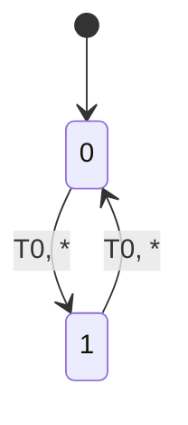

As it stands, it provides an acceptable compromise for perfect forward compatibility. Even if an user sends `T2+` a specific "increase" the lighting intensity, it "wraps around".

If we move on from this to  `A1`:

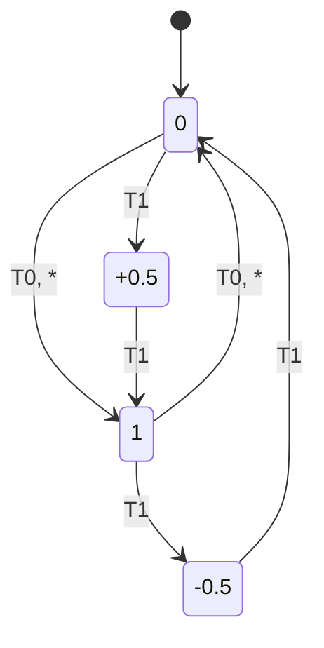

And once more we have a conflict. According to the previous definition for the wildcard, it would match `T1`, making the state machine an NFA once more.
If we refine the wildcard to be "all events not covered on the current or other branches", `T1` no longer poses a problem; so let's keep that definition.

An execution trace for this state machine might be:
```
A2[0] <- T2-
A2[1] <- TN
A2[0]
```

Where `TN` is a version from a future far far away.

However, if we instead have:
```
A2[0] <- T1
A2[+0.5] <- TN -- fails
```

We fail once more since `+0.5` does not have a future fallback.

From this I derive:

>To keep perfect future compatibility, all states must have an outgoing edge with the wildcard

If instead do:

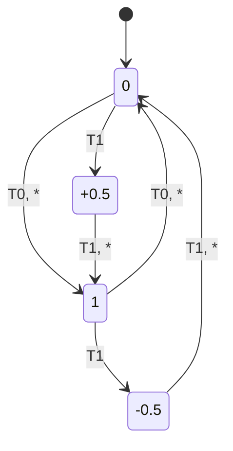

The trace is now valid:
```
A2[0] <- T1
A2[+0.5] <- TN
A2[1]
```

Curiously enough, with this we've also fixed backwards compatibility for this state machine. If, once more, we look at the first improved `A1`:


And try the following trace:

```
A1[0] <- T1
A1[+0.5] <-  T0 -- fails
```

Because `A1[+0.5]` does not have an out edge with `T0`.

We can fix that by adding edges considering `T0` to the states `+0.5` and `-0.5`. Where they end is up to the user but let's just mimic the existing behaviour (`T1`) by just continuing the transition.
So, `apply(+0.5, T0) -> 1` and `apply(-0.5, T0) -> 0`.

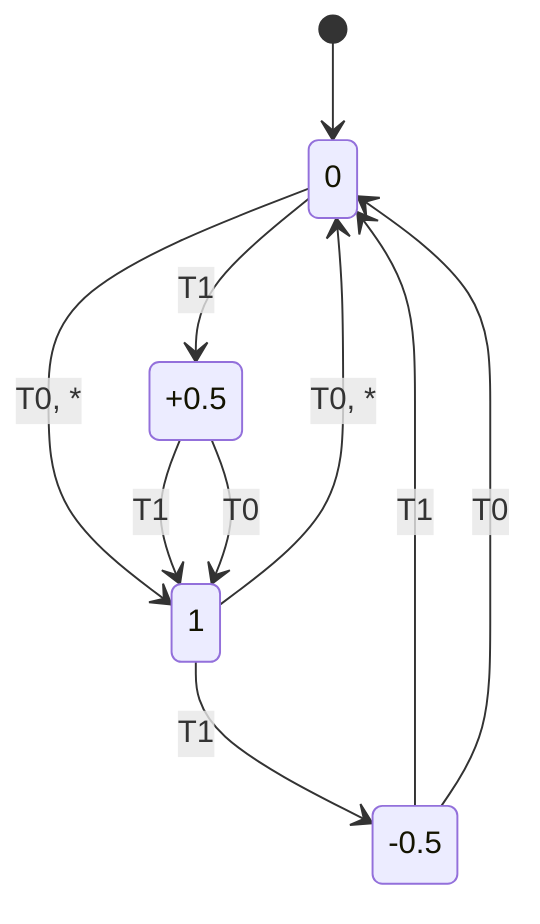

From this we can infer that:

> For perfect backwards compatibility, all new states must have outgoing edges handling the pre-existing set of events.

Now we have edges that could be united:

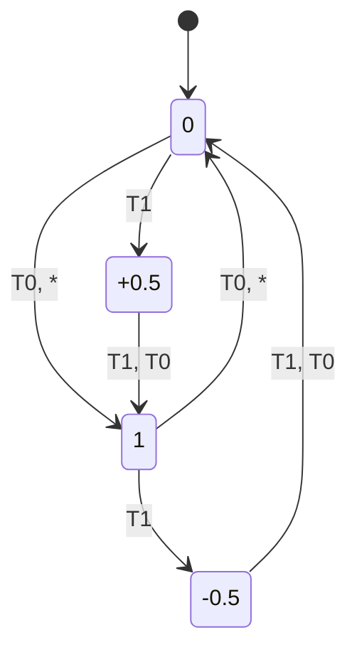

Which was covered by the pattern `T1, *`; we can further simplify this pattern into `*`.
But we lose clarity when reading in this case and the recommendation is to use `*` only to cover future cases.

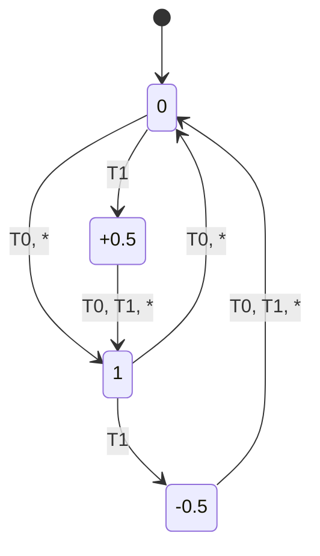

State machines can be placed in the following quadrant considering which properties they have.

Forwards compatibility — all states have outgoing edges with `*`.
Backwards compatibility — all states have outgoing edges containing all states from the previous machine.
```
 ┌──────────────────┬──────────────────┐
 │                  │                  │
 │                  │                  │
 │      Fowards     │       Both       │
 │   Compatibility  │                  │
 │                  │                  │
 │                  │                  │
 ├──────────────────┼──────────────────┤
 │                  │                  │
 │                  │                  │
 │        N/A       │    Backwards     │
 │                  │  Compatibility   │
 │                  │                  │
 │                  │                  │
 └──────────────────┴──────────────────┘
```
